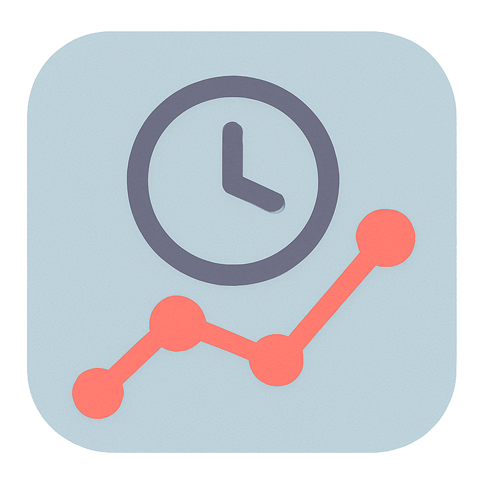

<div align="center">
  

  <h1>Temprix</h1>

  <p>
    <strong>Automatic Window Title & Ticket Tracking for macOS & Windows</strong>
  </p>

  <p>
    <a href="#features">Features</a> •
    <a href="#prerequisites">Prerequisites</a> •
    <a href="#development-setup">Setup</a> •
    <a href="#license">License</a>
  </p>

  <p>
    
    
    
    
    
  </p>
</div>

<br />

**Temprix** runs quietly in your background, monitoring your active window to help effortlessly track time spent on different tasks. It specifically parses window titles to identify ticket numbers (matching patterns like `#1234`) and securely logs this activity locally.

---

## ✨ Features

- **👁️ Automatic Window Detection**: Uses accessibility APIs to detect the currently active window.
- **🎫 Ticket Parsing**: Automatically extracts ticket numbers (e.g., `#1234`) from window titles.
- **🔒 Local & Private**: Securely logs activity to JSON files in `~/Documents/ActivityLogs/`. Data never leaves your machine.
- **🖥️ System Tray Integration**: Unobtrusive menu bar app that stays out of your way.
- **⚙️ Configurable**: Customize regex patterns to match your organization's ticket format.
- **🪟 Cross-Platform**: Works seamlessly on both macOS and Windows.

---

## 🛠️ Prerequisites

- **OS**: macOS or Windows.
- **Node.js** & **npm**: Required for the frontend build process.
- **Rust**: Required for the high-performance backend.
- **Visual Studio C++ Build Tools** (Windows only): Required for compiling Rust on Windows.

---

## 🚀 Development Setup

1.  **Install Dependencies**
    ```bash
    cd src
    npm install
    ```

2.  **Generate Icons** (Optional)
    ```bash
    # From project root
    node build_utils/generate_icons.js
    ```

3.  **Run in Development Mode**
    ```bash
    npm run tauri dev
    ```

---

## ⚠️ Permissions

**Important**: On macOS, this application requires **Screen Recording** permissions to detect the active window title from other applications.

1.  When you first run the app, macOS may prompt you to grant permissions.
2.  If not prompted, go to **System Settings > Privacy & Security > Screen Recording**.
3.  Add/Enable **Temprix** (or your terminal if running in dev mode).

---

## 📂 Project Structure

- `src/`: Frontend source code (HTML/JS/CSS).
- `src-tauri/`: Rust backend code.
    - `tracking.rs`: Logic for window detection and logging.
    - `lib.rs`: Main entry point and system tray management.
- `design/`: Design assets and color definitions.
- `build_utils/`: Helper scripts for assets generation.

---
